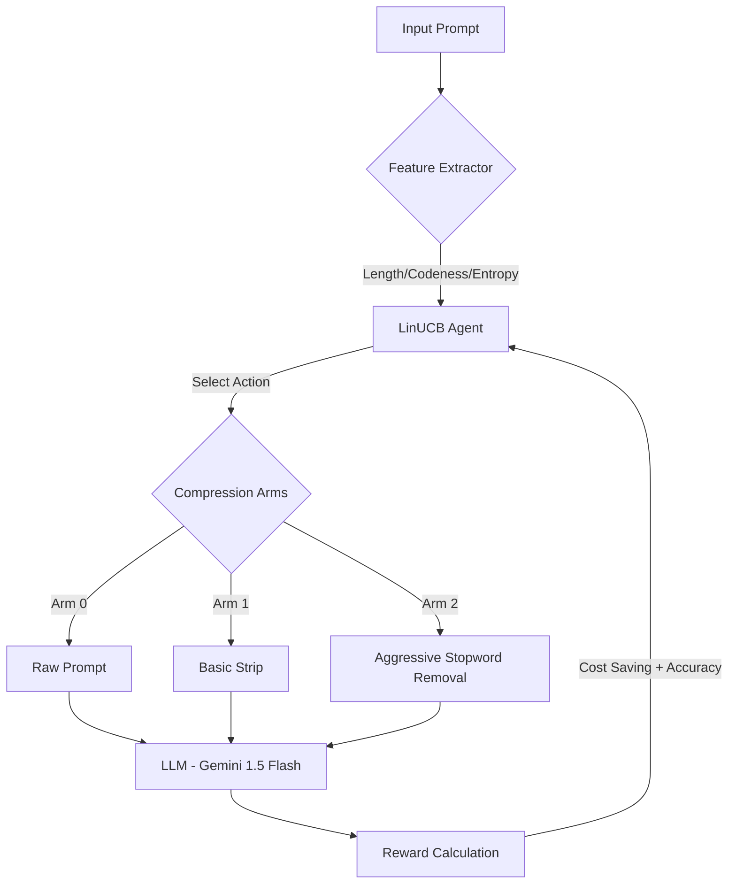

# Adaptive Prompt Compression via LinUCB 🧠

> **"Stop wasting tokens. Optimize your LLM costs with intelligent, adaptive prompt engineering."**

## 🌟 為什麼選擇這個專案？ (Why This Project?)
在 LLM 應用中，**Token = 金錢**。傳統的壓縮方法往往「一刀切」，容易導致程式碼邏輯出錯或語義丟失。
本專案透過 **強化學習 (Contextual Bandit)**，讓 AI 學會：
1. **省錢**：在不影響品質的前提下，自動過濾無效資訊。
2. **保真**：識別敏感內容（如 Code），自動切換至「不壓縮」模式以確保執行正確。
3. **自進化**：隨著使用次數增加，壓縮策略會越來越精準。

---

## 🏗️ 系統架構 (Architecture)

---

## 🚀 快速啟動 (Quick Start)
*(此處保留原有的啟動指令)*

4. **開始實驗：** 程式啟動後，會在瀏覽器中開啟 Streamlit 介面。請在側邊欄輸入您的 API Key 並開始實驗。

## 實驗結果展示 (Results)
*(此處可放上 Streamlit 執行後的「平均獎勵收斂圖」和「自適應策略分佈圖」截圖。)*
- **收斂性分析**：LinUCB 能夠在少量的嘗試後快速收斂，找到平均獎勵較高的策略組合。
- **策略分佈**：觀察不同類別（Chat, Code, Translation等）所傾向選擇的 Arm，驗證系統是否具備對不同上下文的適應能力。
