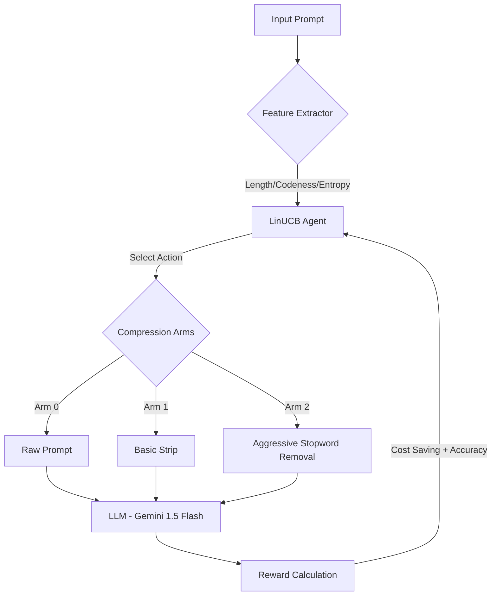

# Adaptive Prompt Compression via LinUCB 🧠

> **"Optimizing LLM efficiency where every token and every request counts. Learning adaptive strategies under extreme resource constraints."**

## 🌟 為什麼選擇這個專案？ (Why This Project?)
本專案專注於解決真實開發環境中的痛點：**API 配額限制與高昂成本**。
透過 **Contextual Bandit (LinUCB)**，系統不僅在優化 Token，更在挑戰 **極限樣本效率 (Sample Efficiency)**：
1. **資源受限學習**：專為每日請求數受限（如 Free-tier API）的環境設計。
2. **精準權衡**：在「成本節省」與「API 穩定性」之間尋找最優解。
3. **自適應路由**：自動識別高敏感內容（如 Code），防止因壓縮導致的系統崩潰。

---

## 🏗️ 系統架構 (Architecture)

---

## 🚀 快速啟動 (Quick Start)
*(此處保留原有的啟動指令)*

4. **開始實驗：** 程式啟動後，會在瀏覽器中開啟 Streamlit 介面。請在側邊欄輸入您的 API Key 並開始實驗。

## 實驗結果展示 (Results)
*(此處可放上 Streamlit 執行後的「平均獎勵收斂圖」和「自適應策略分佈圖」截圖。)*
- **收斂性分析**：LinUCB 能夠在少量的嘗試後快速收斂，找到平均獎勵較高的策略組合。
- **策略分佈**：觀察不同類別（Chat, Code, Translation等）所傾向選擇的 Arm，驗證系統是否具備對不同上下文的適應能力。
