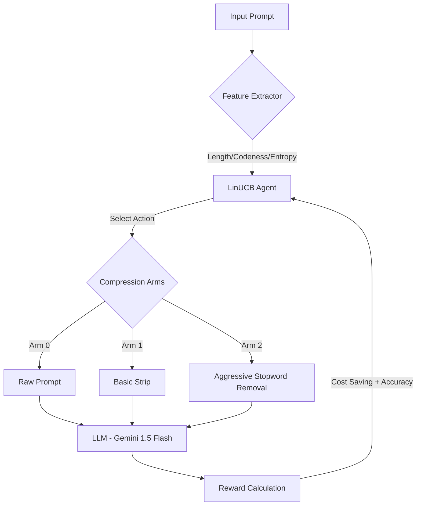

# Adaptive Prompt Compression via LinUCB 🧠

[](https://www.python.org/downloads/)
[](https://adaptive-prompt-compreappr-wanghao.streamlit.app)
[](https://opensource.org/licenses/MIT)
[](https://github.com/howwang0507/Adaptive-Prompt-Compressor/stargazers)

> **"Optimizing LLM efficiency where every token and every request counts. Learning adaptive strategies under extreme resource constraints."**

## 🌟 Overview
In the era of Large Language Models (LLMs), **Token = Money**. Traditional compression methods often use static rules that risk breaking code logic or losing vital semantics. 

This project implements an **Adaptive Prompt Compression** system powered by **Reinforcement Learning (Contextual Bandits)**. The agent learns to dynamically choose the best compression strategy based on input features (length, complexity, and "codeness").

## 🚀 Key Features
- **Adaptive Routing**: Automatically switches between Raw, Basic, and Aggressive compression.
- **Resource-Constrained Learning**: Specially optimized for environments with strict API quotas (e.g., Free-tier 20 RPM/daily limits).
- **Offline Simulation**: Includes a Sim2Real environment to observe learning curves without an API Key.
- **Academic Rigor**: Features a formal research methodology focusing on **Sample Efficiency**.

---

## 🏗️ System Architecture



---

## 📂 Project Structure
- `src/`: Core logic modules
  - `agent.py`: Implementation of the **LinUCB** algorithm.
  - `environment.py`: Real Gemini API and Simulated environments.
  - `utils.py`: Reward functions and data processing tools.
- `tests/`: Unit tests for algorithm stability.
- `app.py`: Interactive Streamlit dashboard.
- `paper_draft.md`: Formal research paper draft.

## 🧪 Engineering Quality
- **Unit Testing**: Powered by `pytest`.
- **Modularity**: Fully decoupled architecture for high maintainability.
- **CI/CD Ready**: Standardized `requirements.txt` and `run.sh`.

## 🛠️ Quick Start
1. **Clone the repo**:
   ```bash
   git clone https://github.com/howwang0507/Adaptive-Prompt-Compressor.git
   cd Adaptive-Prompt-Compressor
   ```
2. **Setup environment**:
   ```bash
   pip install -r requirements.txt
   ```
3. **Run the dashboard**:
   ```bash
   ./run.sh
   ```

## 📊 Results
*(Insert your Streamlit screenshots here showing the convergence of the average reward.)*

- **Convergence**: LinUCB outperforms static rules by penalizing failures and maximizing savings.
- **Robustness**: The system learns to protect sensitive content (like Python code) from aggressive compression.

---

## 📜 License
This project is licensed under the MIT License - see the [LICENSE](LICENSE) file for details.
