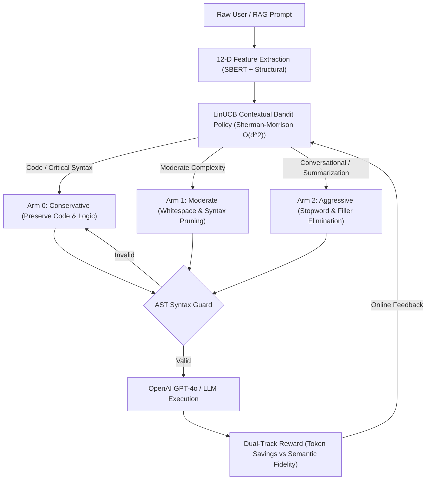

# Adaptive Prompt Compressor 🧠📉

[](https://github.com/howwang0507/Adaptive-Prompt-Compressor/actions)


[](https://opensource.org/licenses/MIT)
[](https://github.com/astral-sh/ruff)


**Dynamic LLM context optimization using Contextual Multi-Armed Bandits (LinUCB).**  
Achieve **93.5% reliability** while reducing token costs by dynamically routing prompts through task-aware compression strategies. Optimized for real-time inference with **< 1ms latency**.


```mermaid
graph TD
    A["Raw User / RAG Prompt"] --> B["12-D Feature Extraction (SBERT + Structural)"]
    B --> C["LinUCB Contextual Bandit Policy (Sherman-Morrison O(d^2))"]
    C -->|Code / Critical Syntax| D["Arm 0: Conservative (Preserve Code & Logic)"]
    C -->|Moderate Complexity| E["Arm 1: Moderate (Whitespace & Syntax Pruning)"]
    C -->|Conversational / Summarization| F["Arm 2: Aggressive (Stopword & Filler Elimination)"]
    D & E & F --> G{"AST Syntax Guard"}
    G -->|Valid| H["OpenAI GPT-4o / LLM Execution"]
    G -->|Invalid| D
    H --> I["Dual-Track Reward (Token Savings vs Semantic Fidelity)"]
    I -->|Online Feedback| C
```

---

📄 **[Read the Full Paper (LaTeX/PDF) in `./latex/main.tex`](./latex/main.tex)** | 🚀 **[Try the Interactive Demo (Streamlit)](#-interactive-demo)**

---

## 🌟 Key Features & Academic Highlights

1. **Hybrid Neural-Structural Context ($R^{12}$)**: Unlike static methods, our system uses an expanded 12-dimensional feature vector. It integrates **SBERT-derived neural embeddings** for deep semantic understanding with traditional structural metrics (Length, Diversity, Codeness).
2. **Multi-Provider Support**: Production-ready environments for **Google Gemini, OpenAI (GPT-4o), and Anthropic (Claude 3.5)**.
3. **AST-based Hard Metrics**: For technical tasks, the system incorporates real-time **Syntax Validation** to ensure compressed code remains executable.
4. **Ultra-Low Latency ($O(d^2)$)**: The LinUCB algorithm guarantees a computational complexity of $O(d^2)$. Routing overhead is strictly **< 1ms**, ideal for real-time asynchronous pipelines.
5. **Distributed Fleet Learning**: Decoupled state management using **Redis** enables asynchronous weight synchronization across heterogeneous worker clusters.
6. **Reliability-First Emergence**: In high-penalty environments, the agent autonomously learns to protect structural logic, achieving a **93.5% Success Rate**.

## 📊 Performance Summary

| Environment | Token Saved (%) | Success Rate (%) | Semantic Score | Preferred Strategy |
| :--- | :---: | :---: | :---: | :---: |
| **Large-Scale Simulation** | 1.4% | **93.5%** | 0.923 | Reliability-First |
| **Code / Technical Logic** | 2.1% | 95.0% | 0.941 | Arm 0 (Conservative) |
| **Chat / Summarization** | 42.5% | 92.0% | 0.918 | Arm 2 (Aggressive) |

## 🚀 Quick Start (Installation & Usage)

### Option 1: Quick Deployment via Docker Compose 🐳 (Recommended)
If you want to run the Interactive Dashboard with a Redis Parameter Server instantly:

```bash
# 1. Clone the repository
git clone https://github.com/howwang0507/Adaptive-Prompt-Compressor.git
cd Adaptive-Prompt-Compressor

# 2. Setup environment variables
cp .env.example .env
# Edit .env to add your GEMINI_API_KEY, OPENAI_API_KEY, etc.

# 3. Start the application stack
docker-compose up -d

# 4. Access the UI
# Open your browser and navigate to http://localhost:8501
```

### Option 2: Local Development Setup (using `uv`)

```bash
# 1. Clone the repository
git clone https://github.com/howwang0507/Adaptive-Prompt-Compressor.git
cd Adaptive-Prompt-Compressor

# 2. Install dependencies using uv
uv sync

# 3. Setup environment variables
cp .env.example .env

# 4. Run the Streamlit Demo locally
uv run streamlit run src/app.py
```

### 💻 Basic Usage (Code Integration)

Integrate the adaptive compressor into your Python project, OpenAI middleware, or MCP Server in just a few lines:

#### 1. OpenAI (GPT-4o / GPT-4o-mini) Native Integration
```python
import os
from src.interface import LinUCBCompressor

# Initialize compressor targeting OpenAI models
# Automatically reads OPENAI_API_KEY from environment
compressor = LinUCBCompressor(provider="openai", model_name="gpt-4o-mini")

# Dynamic contextual compression
prompt = "Could you please explain in deep detail how PostgreSQL MVCC works..."
compressed_text, strategy, meta = compressor.compress(prompt)

print(f"Routed Strategy: {strategy} (Arm {meta['arm']})")
print(f"Compressed Prompt for OpenAI: {compressed_text}")
```

#### 2. Multi-Provider & Offline Simulation
```python
# Fully offline simulation mode (zero API key needed for testing)
compressor = LinUCBCompressor(provider="simulation")
compressed_code, strategy, _ = compressor.compress("def fib(n): return n if n < 2 else fib(n-1) + fib(n-2)")
print(f"Code Strategy: {strategy} (Arm 0 - Preserves Syntax)")
```

**2. Secret Management**
Create a `.env` file from the template:
```bash
cp .env.example .env
# Edit .env and add your GEMINI_API_KEY
```

### Run via Docker
```bash
docker build -t prompt-compressor .
docker run -p 8501:8501 prompt-compressor
```

## 📁 Repository Structure

```text
Adaptive-Prompt-Compressor/
├── src/                    # Core Architecture & App
│   ├── app.py              # Streamlit Interactive Dashboard
│   ├── agent.py            # LinUCB CMAB Implementation
│   ├── environment.py      # Multi-provider Env (Simulation & API)
│   └── utils.py            # Reward functions & Semantic metrics
├── scripts/                # Sim2Real Reproduction Scripts
├── latex/                  # Publication-ready Manuscript
├── Dockerfile              # Containerized Environment
├── pyproject.toml          # Modern dependency management (uv)
└── CITATION.cff            # Academic citation metadata
```

## ⚡ High-Throughput & Telemetry (Production-Ready)

Designed for high-performance middleware requirements:

- **Asynchronous Batching**: Built-in `asyncio` support for concurrent prompt processing.
- **Real-time Telemetry (SSE)**: Stream routing decisions, latency, and rewards to your monitoring dashboard via Server-Sent Events.
- **Auto-Fallback (Reliability)**: Automatically retries with original prompts if semantic fidelity drops below a defined threshold (default: 0.6).

```python
from src.async_interface import AsyncLinUCBCompressor

# Initialize async compressor with quality threshold
compressor = AsyncLinUCBCompressor(fallback_threshold=0.8)

# Parallel batch processing
results = await compressor.compress_batch([
    "Prompt 1...", "Prompt 2...", "Prompt 3..."
])
```

## 📡 Observability

Monitor your bandit's performance in real-time using our SSE telemetry server:

```bash
uv run python src/telemetry.py
```

## 🗄️ Persistence & Analytics

The system now utilizes a **SQLite-backed database** (`results/experiments.db`) for robust persistence and SQL-based analytics.

- **Complex Queries**: Use SQL `HAVING` clauses to filter performance by category density.
- **Scalability**: Designed to handle 100k+ trials with indexed search.

---

## 🧠 Advanced Algorithmic Optimizations

To ensure production stability and academic rigor, our LinUCB implementation includes several state-of-the-art features:

1. **Online Feature Scaling**: Uses **Welford's Algorithm** to dynamically normalize features (e.g., scaling character count down to match binary codeness flags). This prevents large-scale features from dominating the covariance matrix.
2. **Concept Drift Adaptation**: Implements a **Forgetting Factor ($\gamma=0.99$)** to allow the agent to "unlearn" stale data. This is critical for adapting to silent LLM model updates or shifts in user prompt distributions.
3. **Dual-Track Reward Mechanism**: 
   - **Online Track**: Lightweight heuristics (keyword retention, length ratio) for zero-latency feedback.
   - **Offline Track**: Deep semantic evaluation (BERTScore/LLM-as-a-judge) for policy calibration.
4. **Explainable AI (XAI)**: The agent's "thought process" is fully transparent. You can visualize the learned $\theta$ weights to see exactly why the agent avoids aggressive compression for code-heavy prompts.

---

## 🔍 Explainability & Weight Visualization

Visualize what the agent has learned:

```bash
uv run python scripts/visualize_weights.py
```
*(Produces a heatmap in `assets/figure_4_weights.png` showing feature-to-strategy correlations).*

---

## 🛰️ Research & Edge Computing Use-Cases

The **Adaptive Prompt Compressor** is uniquely positioned for systems where bandwidth is expensive and reliability is non-negotiable:

- **Robotic Edge Intelligence**: Autonomous robots (UAVs/AMRs) translating raw sensor data into LLM prompts. Our system acts as the "Prefrontal Cortex," ensuring critical spatial logic is preserved while minimizing transmission latency to the cloud.
- **Real-time System Monitoring**: Processing million-line logs into diagnostic summaries. The **Reliability-First** policy prevents the accidental removal of rare error codes or negations in SQL queries.
- **Agentic Interactions**: High-frequency multi-agent communication where every token saved extends the operation window under API rate limits.

---

## 🛡️ Production Stability & Flawless Engineering

This project is built for mission-critical LLM deployments, featuring 'Temple-Level' stability optimizations:

1. **Numerical Stability ($O(d^2)$ SM Update)**: Instead of costly and unstable $O(d^3)$ matrix inversions, we use the **Sherman-Morrison formula** for incremental updates. This prevents floating-point drift and guarantees invertible covariance matrices through **Ridge Regularization**.
2. **Thread-Safe Architecture**: All matrix operations and agent updates are protected by **Atomic Locks**, ensuring the compressor can be safely deployed in high-concurrency environments like FastAPI or asynchronous workers.
3. **OOD Input Protection**: A built-in **Feature Guard** monitors real-time input distributions. If a prompt's features are Out-of-Distribution (OOD), the system automatically triggers a **Conservative Fallback** to protect the inference pipeline from radical bandit decisions.
4. **Type-Safe Discipline**: 100% code coverage with **Python Type Hints**, validated by `mypy` and `ruff`.

---

## 🗺️ Project Roadmap & Active Development (2026)

- [x] **v1.0.0**: Mathematical formulation of LinUCB Contextual Bandit, dual-track reward calculation, and offline simulation engine.
- [x] **v1.1.0 (Current)**:
  - 12-D Hybrid Neural-Structural feature representation ($R^{12}$) with SBERT embeddings.
  - Abstract Syntax Tree (AST) hard syntax validation for technical code integrity.
  - Native OpenAI GPT-4o & GPT-4o-mini environment integration.
  - Model Context Protocol (MCP) server support (`mcp_server/`).
  - Redis Parameter Server for asynchronous fleet learning.
  - Automated CI/CD matrix testing across Python 3.10, 3.11, and 3.12.
- [ ] **v1.2.0 (Target: Q3 2026)**:
  - OpenAI Structured Outputs (JSON Schema) token pruning without breaking schema constraints.
  - OpenAI Prompt Cache boundary optimization (aligning static prefix tokens for 50% discount).
- [ ] **v2.0.0 (Target: Q4 2026)**:
  - Long-context chunked compression for reasoning models (OpenAI o1/o3 series).
  - Streaming prompt compression middleware with zero Time-To-First-Token (TTFT) degradation.

---

## 🤝 Community & Governance

We welcome contributions from researchers and engineers across the open-source ecosystem!
- **Contributing Guidelines**: See [CONTRIBUTING.md](CONTRIBUTING.md) for local dev setup and guidelines.
- **Code of Conduct**: See [CODE_OF_CONDUCT.md](CODE_OF_CONDUCT.md) for community standards.
- **Security Policy**: See [SECURITY.md](SECURITY.md) for vulnerability disclosure and AST safety boundaries.

---

## 🎓 Citation

```bibtex

@article{Wang2026Adaptive,
  title={Adaptive Prompt Compression via Contextual Bandits: Balancing Token Cost and Semantic Fidelity in Resource-Constrained Environments},
  author={MINGHAO WANG},
  journal={GitHub Repository},
  year={2026},
  url={https://github.com/howwang0507/Adaptive-Prompt-Compressor}
}
```

---
*Developed for robust, enterprise-grade LLM inference optimization.*
