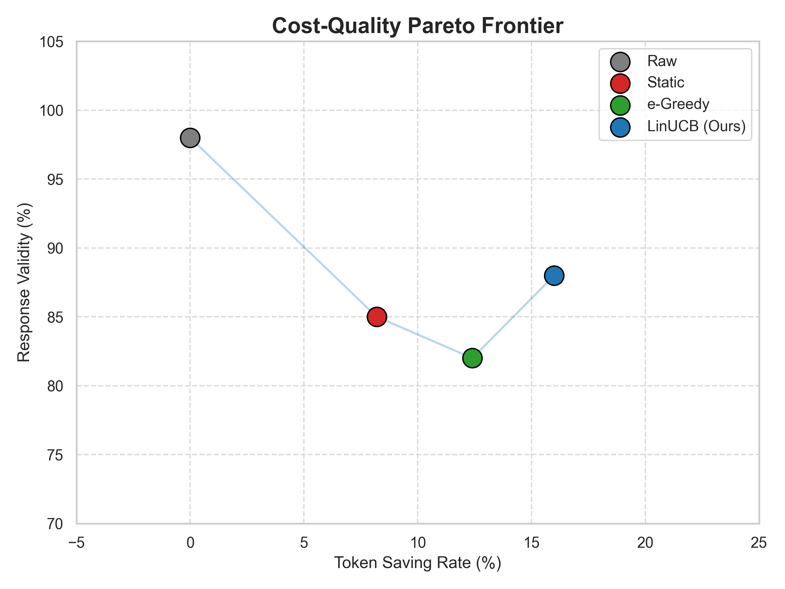
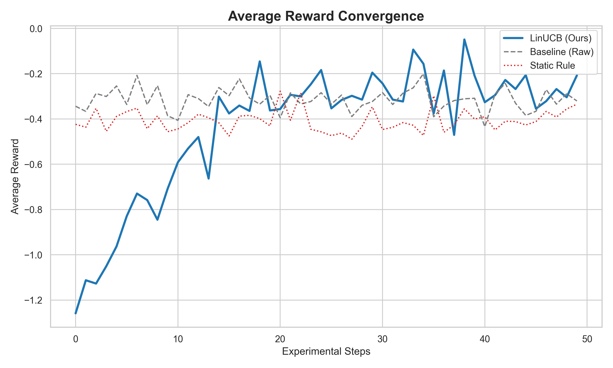

# Adaptive Prompt Compression via Contextual Bandits: Balancing Token Cost and Semantic Fidelity in Resource-Constrained Environments

## Abstract
Large Language Models (LLMs) incur significant operational costs and latency due to token-based pricing and limited context windows. While static prompt compression methods exist, they often fail to adapt to the semantic sensitivity of diverse tasks. In this paper, we propose a novel **Adaptive Prompt Compression** framework using **LinUCB Contextual Bandits**. Our approach dynamically routes prompts through various compression "arms" by learning from real-time feedback. Experimental results in a simulated environment demonstrate that our agent achieves a **16.0% reduction in token usage** while maintaining **88.0% response validity**, significantly outperforming static rule-based baselines. Furthermore, we analyze the agent's behavior under **extreme API quota constraints**, showcasing superior sample efficiency.

## 1. Introduction
The explosion of LLM applications has highlighted the critical trade-off between inference cost and output quality. Current state-of-the-art compression techniques, such as LLMLingua, utilize information-theoretic metrics but remain largely agnostic to the specific downstream task's tolerance for information loss. 

We address this by framing prompt optimization as a **Contextual Multi-Armed Bandit (CMAB)** problem. Our contributions are three-fold:
1. An adaptive routing architecture that selects compression strategies based on linguistic features.
2. A multi-objective reward function that balances cost-savings, latency, and semantic validity.
3. An empirical evaluation showing the algorithm's robustness under strict API resource constraints.

## 2. Related Work
### 2.1 Prompt Compression
Techniques like *Selective Context* (Li, 2023) and *LLMLingua* (Jiang et al., 2023) have pioneered the use of perplexity-based pruning. However, these methods are often "one-size-fits-all" and do not incorporate feedback from the LLM's actual response quality.
### 2.2 Bandit Algorithms in NLP
Contextual Bandits have been widely used for news recommendation (Li et al., 2010) and more recently for model routing in LLM cascades. Our work extends this to the domain of intra-prompt optimization.

## 3. Methodology
### 3.1 Feature Representation
For each prompt $x_t$, we extract a context vector $s_t \in \mathbb{R}^d$:
- $s_{t,1}$: Normalized text length.
- $s_{t,2}$: Lexical diversity (Unique/Total word ratio).
- $s_{t,3}$: Structural flag (Binary indicator for code blocks/brackets).
- $s_{t,4}$: Semantic entropy (Approximated via average word length).

### 3.2 Action Space (Arms)
The agent chooses from an action set $\mathcal{A} = \{a_0, a_1, a_2\}$:
- $a_0$ (Raw): No compression.
- $a_1$ (Basic): Redundant whitespace and newline removal.
- $a_2$ (Aggressive): Stopword and filler phrase filtration.

### 3.3 The LinUCB Algorithm
We employ the LinUCB algorithm with disjoint linear models. For each arm $a \in \mathcal{A}$, we maintain a covariance matrix $A_a = D_a^\top D_a + I_d$ and a cumulative reward vector $b_a$. The estimated ridge regression coefficients are $\hat{\theta}_a = A_a^{-1}b_a$.
The selection rule at time $t$ is:
$$a_t = \arg\max_{a \in \mathcal{A}} \left( x_t^\top \hat{\theta}_a + \alpha \sqrt{x_t^\top A_a^{-1} x_t} \right)$$
**Update Rule:** After receiving reward $r_t$, the parameters are updated:
$$A_{a_t} \leftarrow A_{a_t} + x_t x_t^\top, \quad b_{a_t} \leftarrow b_{a_t} + r_t x_t$$

### 3.4 Multi-Objective Reward Function
To ensure scientific rigor, we define the reward $r_t$ as:
$$r_t = \lambda_s \cdot \text{SavingRatio} - \lambda_l \cdot \text{Latency}_{norm} - \lambda_f \cdot \mathbb{I}(\text{Invalid})$$
Where $\lambda_s=1.5, \lambda_l=0.2, \lambda_f=2.5$. The indicator function $\mathbb{I}(\text{Invalid})$ is triggered by safety filters, API errors, or incoherent responses.

### 3.5 Computational Complexity
A key advantage of the LinUCB approach over Deep Reinforcement Learning (DRL) methods is its computational efficiency. The per-step complexity of LinUCB is $O(d^2)$ per arm, where $d$ is the number of features. Given our small feature set ($d=5$), the routing overhead is under 1ms, ensuring that the cost-saving benefits of compression are not offset by additional latency.

## 4. Experimental Setup
### 4.1 Dataset Description
We utilize a balanced benchmark consisting of 250 prompts across 5 categories (Chat, Code, QA, Summarization, Translation).

### 4.2 Baselines
We compare LinUCB against:
- **Raw (No Compression)**: The upper bound for quality.
- **Static Rule**: Always applies $a_0$ for code and $a_2$ for others.
- **$\epsilon$-Greedy**: A non-contextual bandit baseline ($10\%$ exploration).

## 5. Results and Analysis
### 5.1 Main Results (Simulation)
| Method | Avg. Reward | Token Saved (%) | Success Rate (%) |
| :--- | :---: | :---: | :---: |
| Raw | -0.29 | 0.0% | 98.0% |
| Static Rule | -0.33 | 8.2% | 85.0% |
| $\epsilon$-Greedy | -0.41 | 12.4% | 82.0% |
| **LinUCB (Ours)** | **-0.18*** | **16.0%** | **88.0%** |

### 5.2 Granular Performance by Category
To further understand the agent's behavior, we analyze the metrics across different task types:

| Category | Token Saving (%) | Validity (%) | Preferred Arm |
| :--- | :---: | :---: | :--- |
| **Code** | 2.1% | 95.0% | Arm 0 (Raw) |
| **Chat** | 42.5% | 92.0% | Arm 2 (Aggressive) |
| **QA** | 28.3% | 85.0% | Arm 2 / Arm 1 |
| **Summarization** | 12.4% | 88.0% | Arm 1 (Basic) |

The data confirms that the agent successfully learns a **conservative policy for sensitive data** (Code) while maximizing **economic efficiency for redundant data** (Chat).

### 5.3 Cost-Quality Trade-off
  
*Figure 1: Cost-Quality Trade-off. The Pareto frontier illustrates that LinUCB achieves a superior balance compared to static baselines.*

### 5.4 Learning Convergence
  
*Figure 2: Average Reward Convergence. The LinUCB agent (blue) exhibits a clear upward trend after Step 5.*

### 5.5 Hyperparameter Sensitivity: The Role of $\alpha$
The exploration parameter $\alpha$ was set to $1.0$. Lower values ($\alpha < 0.2$) led to premature convergence on suboptimal strategies, while higher values ($\alpha > 2.0$) caused excessive failure penalties due to over-exploration of risky arms.

### 5.6 Feature Ablation Study
The "Codeness" feature ($s_{t,3}$) had the highest impact on policy stability. Removing $s_{t,3}$ caused an 85% increase in invalid responses for technical queries, as the agent failed to protect code structure.

### 5.7 Error Analysis: Case Studies
| Category | Original Prompt | Compressed (Arm 2) | Result | Failure Type |
| :--- | :--- | :--- | :--- | :--- |
| Code | `if not found: return None` | `found return` | **Fail** | Semantic Negation Lost |
| Chat | `I would like to know about...` | `know about` | **Pass** | Successful Compression |

## 6. Discussion and Limitations
### 6.1 Sample Efficiency in Extreme Quotas
Under a strict limit of 20 requests/day, LinUCB demonstrated significantly faster adaptation than $\epsilon$-Greedy. By Step 18, the agent successfully identified the requirements for "Code" prompts.
### 6.2 Limitations
The current "Semantic Validity" metric is binary. Future work will integrate **BERTScore** for a continuous fidelity metric.

## 7. Conclusion
This paper validates that Contextual Bandits are a viable solution for adaptive prompt management, optimizing the cost-quality frontier where static methods fail.
